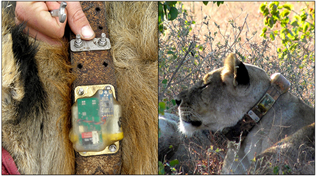
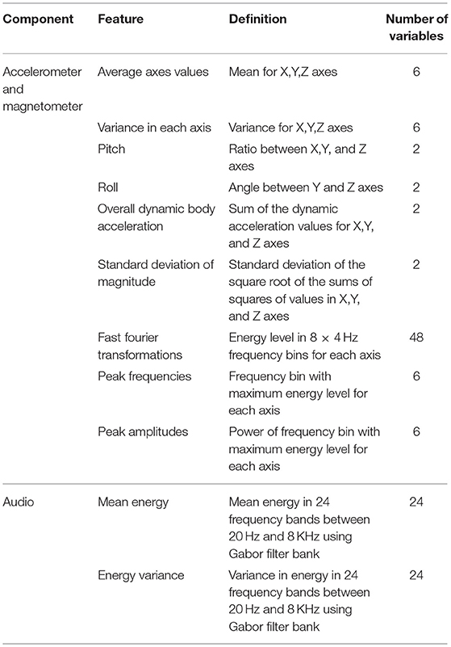

[](https://creativecommons.org/licenses/by-nc-sa/4.0/legalcode)

# ShumbaBehaviour



Dataset of lion accelerometry labels derived from audio collars. This was obtained from 8 lion in Bubye Valley Conservancy in 2014. This dataset served as the basis for the paper

Listening to lions: animal-borne acoustic sensors improve bio-logger calibration and behaviour classification performance. *Frontiers in Ecology and Evolution 6 (2018): 171.*, Wijers, Matthew, Paul Trethowan, Andrew Markham, Byron Du Preez, Simon Chamaillé-Jammes, Andrew Loveridge, and David Macdonald.

# Sensors

Accelerometer data was captured continuously at a rate of 32 Hz. Microphone was sampled at 8kHz.

For more information, please refer to the paper.

# Labels

Labels were assigned by an expert listening to the on-collar audio. The five labels are:

* rest
* walk
* fast
* drink
* eat

The label resolution is one second. Approximately 20 hours of data has been labelled.

# Summary data

This is the data that was used to build the random forest classifiers. This consists of summary data for each second of sensor data. Please refer to the paper for more details.




# Raw accelerometer data

This is raw accelerometer data, useful for training new classifiers that don't require summary data (e.g. deep learning based ones), or for resampling to different rates, or for adapting to different collar placements. The data consists of an array for each axis e.g.

[22.0, 22.0, 23.0, 23.0, 22.0, 22.0, 22.0, 22.0, 22.0, 22.0, 22.0, 22.0, 22.0, 22.0, 22.0, 22.0, 22.0, 22.0, 22.0, 22.0, 22.0, 22.0, 23.0, 23.0, 25.0, 25.0, 24.0, 24.0, 23.0, 23.0, 23.0, 23.0]

Sensor values are in raw units (integer, 32.0 = 1g)

# License

This dataset is released under CC BY-NC-SA 4.0.

You are free to:

* Share — copy and redistribute the material in any medium or format
* Adapt — remix, transform, and build upon the material

The licensor cannot revoke these freedoms as long as you follow the license terms.

Under the following terms:

* Attribution — You must give appropriate credit, provide a link to the license, and indicate if changes were made. You may do so in any reasonable manner, but not in any way that suggests the licensor endorses you or your use.
* NonCommercial — You may not use the material for commercial purposes .
* ShareAlike — If you remix, transform, or build upon the material, you must distribute your contributions under the same license as the original.
* No additional restrictions — You may not apply legal terms or technological measures that legally restrict others from doing anything the license permits.

# Ethical Statement

This study was carried out in accordance with the recommendations of the Use of Animals in Research, ASAB/ABS. The protocol was approved by the University of Oxford Animal Welfare and Ethical Review Board and the University Veterinary Services Department. Project staff were qualified to capture and handle the study animals by attendance at Zimbabwe's Physical and Chemical Capture of Wild Animals Course and held valid drugs licenses (Dangerous Drugs License No. 2014/16). The animals were captured with permission from the landowner and conservancy management.

# Acknowledgments

We are grateful to the John Fell Fund and the Beit Trust for funding this research and thank the management staff of the Bubye valley Conservancy for giving us access to their property. We also thank Biotrack for their assistance in the manufacturing of the bio-loggers. 

# Citation

If you use this dataset in your work, please cite the following work:

Listening to lions: animal-borne acoustic sensors improve bio-logger calibration and behaviour classification performance. *Frontiers in Ecology and Evolution 6 (2018): 171.*, Wijers, Matthew, Paul Trethowan, Andrew Markham, Byron Du Preez, Simon Chamaillé-Jammes, Andrew Loveridge, and David Macdonald.

https://www.frontiersin.org/articles/10.3389/fevo.2018.00171/full

```
@article{wijers2018listening,
  title={Listening to lions: animal-borne acoustic sensors improve bio-logger calibration and behaviour classification performance},
  author={Wijers, Matthew and Trethowan, Paul and Markham, Andrew and Du Preez, Byron and Chamaill{\'e}-Jammes, Simon and Loveridge, Andrew and Macdonald, David},
  journal={Frontiers in Ecology and Evolution},
  volume={6},
  pages={171},
  year={2018},
  publisher={Frontiers Media SA}
}
```
